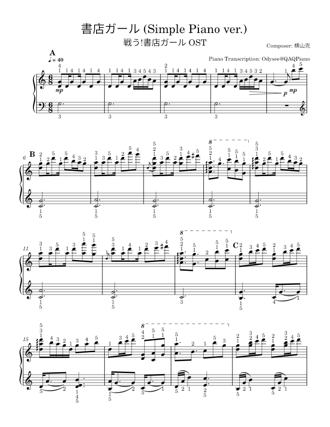

# PianoFingering.jl

PianoFingering.jl is an automatic fingering generator for piano scores, written in the Julia language.



There is no "best fingering", the fingerings generated by PianoFingering.jl are for reference only.

THIS PACKAGE ONLY TESTED ON LINUX.

Future Works:

1. Support input of MIDI performances. (This requires training neural networks to segment notes for the left hand and right hand.)

2. Replace the annotation algorithm with a hybrid fingering annotation algorithm that combines data-driven and rule-based methods.

3. Eliminate the dependency on music21. (Maintain MusicXML.jl)

## How to use it

### Pre-requirement

> Prompt: You can copy all following commands start with ❯ 

Install Python (>3.11) and Julia (>1.9). 

Make sure:

``` shell
❯ python -V
Python 3.11.3
❯ julia -v
julia version 1.9.0
```

Install `music21` (>9.1.0):

``` shell
❯ pip3 install music21
```

Clone this project to your computer and change directory to `PianoFingering.jl` folder, then:

``` shell
❯ julia
❯ using Pkg
❯ Pkg.activate(".")
❯ Pkg.instantiate()
```

Now you have installed all the dependency. Close your terminal.

### Run Programe

1. Put your `.musicxml` file to `musicxml` folder, suppose we have an `example.musicxml` file right now.

2. Change directory to `PianoFingering.jl` folder:

``` shell
❯ julia -t auto
❯ using Pkg
❯ Pkg.activate(".")
❯ using PianoFingering
❯ fingering("example.musicxml")
```

Wait for the program to complete, annotated piano score `example_output.musicxml` will be stored in `output` folder, this may take a few minutes.

### PIG Dataset

[PIG](https://beam.kisarazu.ac.jp/~saito/research/PianoFingeringDataset/) is publicly available data for academic research on piano fingering.

If you want to fingering a PIG format `.txt` file, just put `.txt` in `pig` folder. Then after `using PianoFingering`:

``` shell
❯ fingering("pig_example.txt")
```

### Musicxml to PIG

Fingering a `.musicxml` file to PIG format:
``` shell
❯ xml_to_pig("example.musicxml")
```

### Feedback

If you encounter error, or musicxml file can't fingering correctly. Please open a issue and upload your musicxml file.
